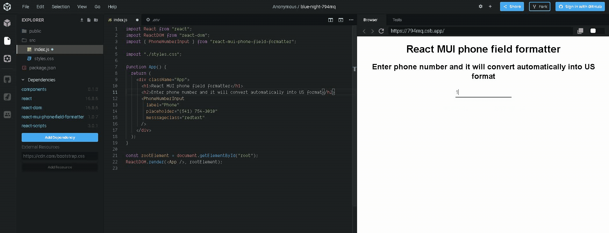

# react-mui-phone-field-formatter
A library of React component created using `create-react-app`.

## Installation
Run the following command:
`npm install react-mui-phone-field-formatter`

## How to use
```
import { PhoneNumberInput } from "react-mui-phone-field-formatter";

<PhoneNumberInput
        label="Phone"
        placeholder="(541) 754-3010"
        messsageclass="redtext"
      />
```
##Demo


